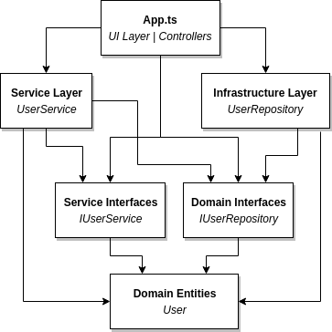

# Basic implementation of Onion Architecture

Understanding the Onion Architecture and it's imlementaion using Express and TypeScript.

Main advantage that I see in Onion Architecture is, this develops loosely coupled application and communicates from outer layes to inner layers via interfaces.

## Main Layers

- Domain Layer
- Service Layer
- Application Layer
- Infrastructure Layer

### Domain Layer (Domain Model)

- Includes Domain Entities and Domain Interfaces (Repository Interfaces).
- No codes that talking to DB
- No any Business functions
- No Implementaions. Just the definition of Models and it's interfaces

### Service Layer (Domain Services)

- More commonly, Interfaces with CRUD operations
- Interfaces are kept separate from it's implementation

### Application Layer (Application Services)

- Implementation of Service interfaces. This will deal with data from Repositories and process requests that are coming from UI Layer
- Act as a middleware to provide data from Infrastructure Layer to UI
- Depends on Interfaces

### Infrastructure Layer

- Outermost Layer 
- Knows about the DB and other third party services (Other Layers does not know about the how Data is getting and what is the technology)
- Implementation of the Interfaces defined in Domain Layer

## References
https://www.codeproject.com/Articles/1028481/Understanding-Onion-Architecture-2

